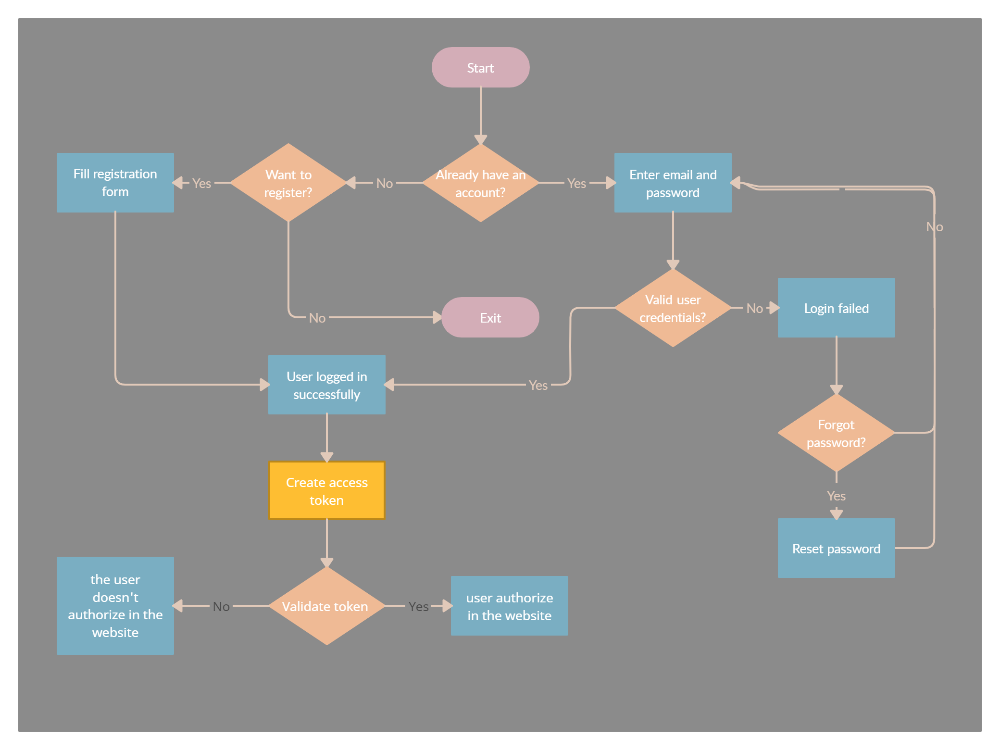

# bearer-auth

**Links and Resources**
[ci/cd](https://github.com/malakMomani/bearer-auth/actions)

[Github Repo](https://github.com/malakMomani/bearer-auth)

[Pull Request](https://github.com/malakMomani/bearer-auth/pull/1)

[heroku deployment](https://malak-bearer-auth.herokuapp.com)

